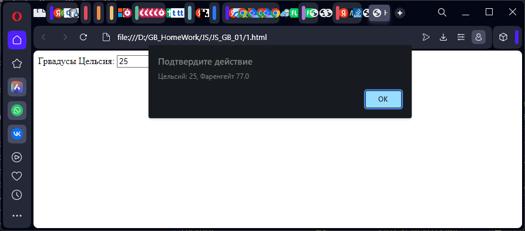
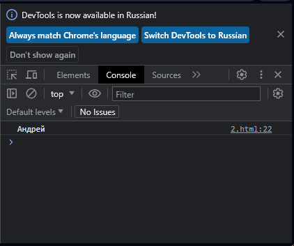
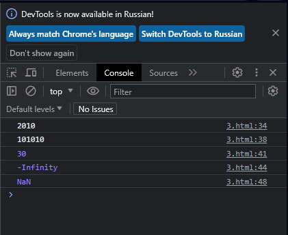
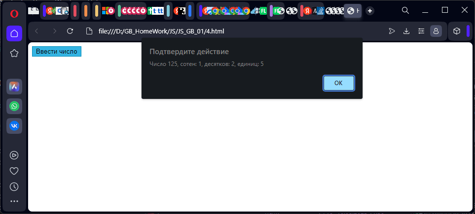

# Основы языка JavaScript

## Задание 1

> Обязательное задание.

Необходимо пользователя попросить ввести температуру в градусах Цельсия,
преобразовать введенное пользователем значение в соответствующую температуру
в градусах по Фаренгейту и вывести в alert сообщение с текстом:<br>
```"Цельсий: {C}, Фаренгейт: {F}"```

Где вместо {C} и {F} должны быть подставлены соответствующие значения, которые
были получены ранее.
Формула перевода градусов Цельсия в градусы Фаренгейта:<br>
градусы Фаренгейта = (9 / 5) * градусы Цельсия + 32

Уточнение: пользователь всегда вводит корректное число.

**Выполнение**




## Задание 2

> Обязательное задание.

Необходимо создать переменную name, записать в эту переменную свое имя.
Необходимо также создать переменную admin и присвоить этой переменной значение
из переменной name.
Вывести значение переменной admin в консоль.

**Выполнение**



## Задание 3

> Обязательное задание.

Необходимо вывести в консоль значения выражений:
10 + 10 + "10"
10 + "10" + 10
10 + 10 + +"10"
10 / -""
10 / +"2,5"
В этих выражениях нет опечаток, вам их нужно скопировать и вывести в консоль.

Над каждым выводом в консоль необходимо объяснить почему мы получаем такой
результат.

**Выполнение**
```js
  // результат "2010" - сначала будут сложены первых 2 чмсла,
  // после приведены к строке и добавлено 10
  console.log(10 + 10 + "10");

  // результат "101010" - первое приводится к строке, т.к второе слагаемое строчное - "1010",
  // третье приводится к строке т.к. результат первого сложения строка
  console.log(10 + "10" + 10);

  // результат 30 - первая операция сложит два числа 10 = 20, третье число из строки приводится в число 
  console.log(10 + 10 + +"10");

  // результат -Infinity - [-""] - пустое значение "" приводится к 0 операцией -. Деление на -0 дает минус бесконечность 
  console.log(10 / -"");

  // результат Nan - операция приведения +"2,5" дает NaN, т.к. в строке присутствует недопустимый символ [,]
  // деление на NaN это NaN
  console.log(10 / +"2,5");
  ```
  
  

## Задание 4

> Необязательное задание.

Необходимо от пользователя получить число.
Необходимо вывести разряды числа, а именно: количество сотен, десятков и единиц.

Пример:
Пользователь ввел число 163. Программа должна вывести:
"В числе 163 количество сотен: 1, десятков: 6, единиц: 3"

Пример 2:
Пользователь ввел число 74. Программа должна вывести:
"В числе 74 количество сотен: 0, десятков: 7, единиц: 4"

Пример 3:
Пользователь ввел число 9537. Программа должна вывести:
"В числе 9537 количество сотен: 5, десятков: 3, единиц: 7"

Уточнение: пользователь всегда вводит корректное положительное целое число.

**Выполненеи**

